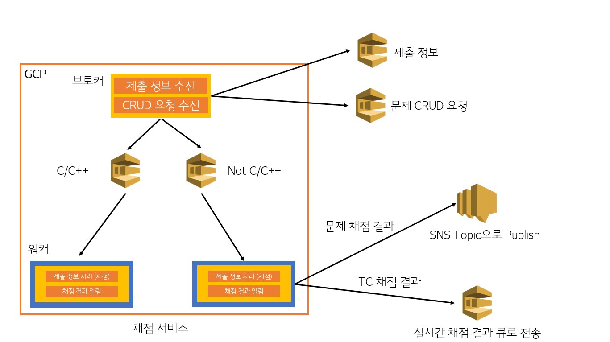

# JUDGE-SERVICE
## 진행 상황  
* 채점 서버에 필요한 정보들을 저장할 구조체 구현  
1) 채점 큐에서 빼낸 정보 (문제 번호, 언어, 코드, 채점 번호, 시간 제한, 메모리 제한)  
2) 채점 결과 (채점 번호, 결과, 시간, 메모리, 에러 메세지)  
3) 언어 별 설정 (컴파일 명령어, 실행 명령어, 파일 확장자, 채점 기준)
* 현재 isolate 사용법 헤딩하며 알아보고 있습니다.    

## 채점 과정  
1) 채점 큐 (SQS)에서 채점 정보를 빼냅니다.
2) 빼낸 정보를 바탕으로 채점을 진행합니다.  
   주어진 코드를 언어에 맞게 컴파일 후, 테스트케이스의 입력을 코드에 넣어 샌드박스 환경에서 실행합니다.  
   (샌드박스 환경: [isolate](https://github.com/ioi/isolate), [isolate docs](https://www.ucw.cz/moe/isolate.1.html))  
3) 샌드박스 내 저장된 출력 파일과 테스트케이스의 출력 파일을 비교하여 채점합니다.  
4) 채점 결과를 SNS로 보냅니다.  
   이때 채점 결과의 형식(body)는 다음과 같습니다.  
   |이름|설명|  
   |---|---|
   |id|**제출** 번호|  
   |user_id|사용자 아이디|
   |problem_id|문제 번호|
   |language_code|언어 코드|
   |memory_limited|메모리 제한(MB)|
   |time_limited|시간 제한(ms)|
   |judge_result|채점 결과|
   |error_message|에러 메세지: 컴파일 에러, 런타임 에러 등|  
이때 에러 메세지는 컴파일 에러, 런타임 에러일 때만 존재합니다.  
다른 경우엔 null로 보냅니다.

## 예상 구조도  

추후 그림은 언제든지 수정될 수 있습니다.  

## TODO
* 채점 큐에서 채점 정보 빼내기 (SQS 사용)
* 채점 완료 후 정보 SNS로 보내기  
* 런타임 에러 여부 / 시간, 메모리 사용 현황도 제출 정보에 포함시키기

## 조금 더 자세한 설명
 
[Notion](https://dripbox.notion.site/88eaba989d5e4a36a45771e835cb836f?pvs=4)
