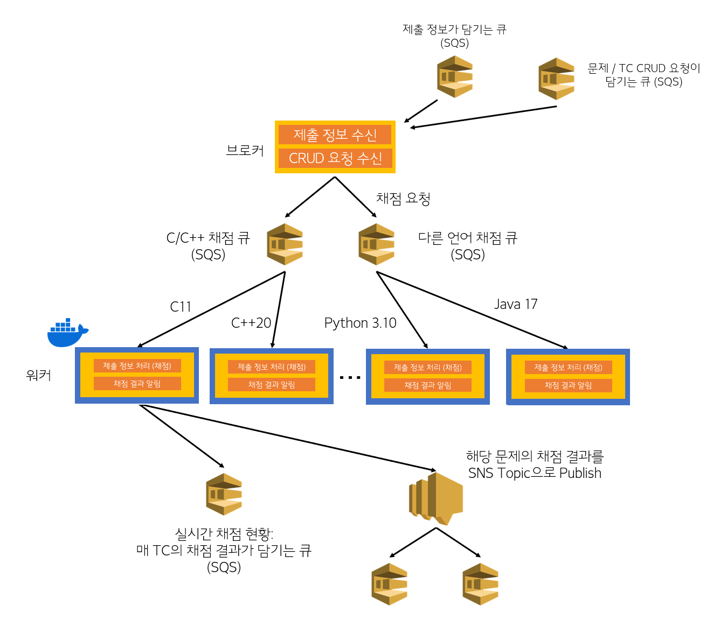

# JUDGE-SERVICE
마지막으로 수정한 날짜: 2023-12-14 19:30

## 진행 상황  
* SQS에서 제출 정보 받아오기 완료
* 받은 메세지를 rapidjson을 이용해, 파싱하여 제공된 정보를 사용, 채점 완료
* 채점 결과를 다시 json의 형태로 만들어 SNS로 보내기 완료
* 채점 결과에 실행 시간, 메모리 사용량 및 에러 메세지 추가 완료
  - 에러 메세지: 런타임 에러의 경우, 해당 프로세스가 수신한 시그널을 출력  
    ex) Caught fatal signal 11 -> SIGSEGV
* 채점을 하며 매 테스트 케이스의 채점 결과를 보내는 것 완료 (실시간 채점현황 용)
* 문제 관리 서비스에서 CRUD 요청이 오면 채점 서버에도 적용되도록 동기화 완료

## 구조도


## 채점 과정  


1) 채점 큐 (SQS)에서 채점 정보를 빼냅니다.
2) 빼낸 정보를 바탕으로 채점을 진행합니다.  
   주어진 코드를 언어에 맞게 컴파일 후, 테스트케이스의 입력을 코드에 넣어 샌드박스 환경에서 실행합니다.  
   (샌드박스 환경: [isolate](https://github.com/ioi/isolate), [isolate docs](https://www.ucw.cz/moe/isolate.1.html))  
3) 샌드박스 내 저장된 출력 파일과 테스트케이스의 출력 파일을 비교하여 채점합니다.  
4) 채점 결과를 SNS로 보냅니다.  
   이때 채점 결과의 형식(body)는 다음과 같습니다.  
   |이름|설명|  
   |---|---|
   |id|**제출** 번호|  
   |user_id|사용자 아이디|
   |problem_id|문제 번호|
   |language_code|언어 코드|
   |memory_limited|메모리 제한(MB)|
   |time_limited|시간 제한(ms)|
   |judge_result|채점 결과|
   |error_message|에러 메세지: 컴파일 에러, 런타임 에러 등|  
이때 에러 메세지는 컴파일 에러, 런타임 에러일 때만 존재합니다.  
다른 경우엔 null로 보냅니다.

### SNS로 보내는 데이터 예시
```json
{
    "id": 12485120,
    "user_id": 124125,
    "problem_id": 30461,
    "language_code": 1,       // CPP
    "memory_limited": 1024,   // MB
    "time_limited": 1000,     // ms
    "memory_used": 2020,      // KB
    "time_used": 144,         // ms
    "judge_result": 1,        // AC
    "error_message": null
}
```
AC나 WA같이 에러가 따로 발생하지 않았다면,  
error_message는 **null**로 보냅니다.  
- judge_result: 정수의 형태로 주어집니다.
```cpp
enum judge_result {
    NJ, AC, WA, CE, RE, TLE, MLE, OLE, SE
};
```
|채점 결과| 값 | 설명|
|---|---|---|
|NJ|0|Not Judged, 채점되지 않음. |
|AC|1|Accepted, 정답. 출력 결과가 일치함|
|WA|2|Wrong Answer, 오답. 출력 결과가 일치하지 않음|
|CE|3|Compile Error, 컴파일 에러|
|RE|4|Runtime Error, 런타임 에러|
|TLE|5|Time Limit Exceeded, 시간 초과|
|MLE|6|Memory Limit Exceeded, 메모리 초과|
|OLE|7|Output Limit Exceeded, 출력 초과|
|SE|8|Sandbox Error, 샌드박스 에러|

- language_code: 정수의 형태로 주어집니다.
```cpp
enum language_code {
    C, JAVA, PYTHON, CPP
};
```
|언어| 값 |
|---|---|
|C|0|
|CPP|1|
|Java|2|
|Python|3|
|DEFAULT|9|

## 실시간 채점 현황
채점 서비스는 특정 문제에 대한 제출 요청이 들어오면,  
매 테스트 케이스마다 채점을 진행한다.

보내는 정보는 다음과 같다.  
```json
{
  "id": (제출 id),
  "problem_id": (문제 id),
  "tc_total": (테스트 케이스 총 개수),
  "tc_cur": (현재 채점한 테스트 케이스 개수),
  "result": (현재 채점 결과)
}
```

이때 result는 앞서 설명한 judge_result와 동일하다.

## 문제 CRUD 요청 처리
문제 관리 서비스에서 문제 (정확히는 테스트케이스) CRUD 요청이 오면,  
채점 서버에도 적용되도록 동기화한다.  
* Testcase_ADD: 테스트케이스 추가
  - 문제가 없다면, 디렉토리 생성
  - 주어진 id의 테스트케이스가 없다면, 테스트케이스 추가
  - 이미 있다면, 요청된 테스트케이스의 내용으로 덮어씌움
* Testcase_UPDATE: 테스트케이스 수정
  - 주어진 id의 테스트케이스가 없다면, 에러 메세지 출력
  - 이미 있다면, 요청된 테스트케이스의 내용으로 덮어씌움
* Testcase_DELETE: 테스트케이스 삭제
  - 주어진 id의 테스트케이스가 없다면, 에러 메세지 출력
  - 이미 있다면, 삭제
  - 삭제 시 테스트케이스의 id를 재정렬

## Dependency  
* [isolate](https://www.github.com/ioi/isolate)
* [AWS SQS](https://aws.amazon.com/ko/sqs/)
* [AWS SNS](https://aws.amazon.com/ko/sns/)
* [rapidjson](https://github.com/Tencent/rapidjson/)
  ```bash
  sudo apt-get install rapidjson-dev
  ```

## 채점 서버 구축하기
### 호스트 머신의 설정 확인하기
위 채점 서비스는 [isolate](https://www.github.com/ioi/isolate) 를 사용하여 샌드박스 환경에서 채점을 진행합니다.  
따라서 워커가 올라갈 호스트 머신은 isolate와 호환이 되는 환경이어야 합니다.  

isolate에서 현재 cgroup v2를 지원하고 있지 않기에,  
cgroup v1을 사용하는 환경에서만 구축이 가능합니다.  
ex) Ubuntu 20.04 LTS   
```shell
stat -fc %T /sys/fs/cgroup/
```
다음과 같은 명령어를 실행하여 현재 환경의 cgroup 버전을 확인할 수 있습니다.  
* cgroup v1: tmpfs
* cgroup v2: cgroup2fs

명령어 실행 시 성공적으로 tmpfs가 나왔다면  
아래의 과정들을 따라 서버 구축을 진행해주시면 됩니다.
### 커널 및 시스템 설정
[Determinism 관련 IOI Checklist](https://ioi.github.io/checklist/)  
코드 실행 시 최대한 일관된 결과를 제공해주기 위해   
커널 및 시스템의 설정을 건드려야 합니다.  
swap, ASLR 등 코드 실행에 영향을 미칠 수 있는 요소들을 배제해야 합니다.  
root에서 ```sh kernel_tuning.sh``` 을 실행시켜 설정할 수 있습니다.
### 테스트 케이스 준비
문제 관리 서비스에서 갖고 있는 테스트 케이스 파일들을  
채점 서비스에서도 갖고 있어야 합니다.  
브로커와 워커는 바인드 마운트로 testcases 폴더를 공유하고 있습니다.  
따라서 컨테이너 실행 전에 미리 testcases 폴더를 준비하여야 합니다.
### 컨테이너 준비
* 브로커
  ```shell
  docker run -it -d --privileged --entrypoint ./JUDGE-SERVICE -v ./testcases:/home/JUDGE-SERVICE/testcases pridom1128/broker:1.5
  ```
* 워커 (C/C++용)
  ```shell
  docker run -it -d --privileged --entrypoint ./JUDGE-SERVICE -v ./testcases:/home/JUDGE-SERVICE/testcases pridom1128/worker:1.5 1
  ```
* 워커 (C/C++ 이외)
  ```shell
  docker run -it --privileged --entrypoint ./JUDGE-SERVICE -v ./testcases:/home/JUDGE-SERVICE/testcases pridom1128/worker:1.5 0
  ```
